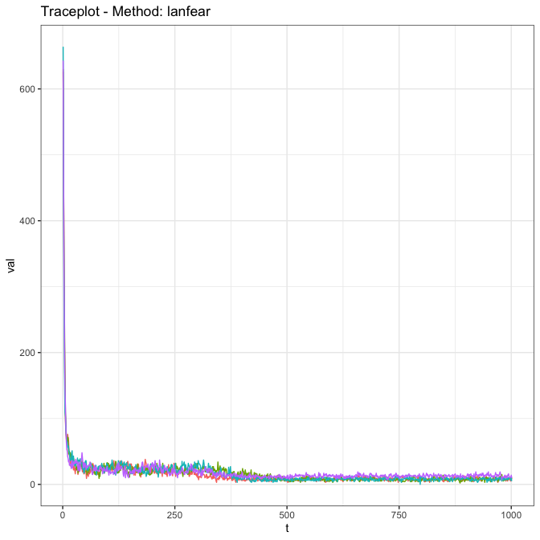

<!-- README.md is generated from README.Rmd. Please edit that file -->

# skipTrack

<!-- badges: start -->

[](https://lifecycle.r-lib.org/articles/stages.html#experimental)
[](https://github.com/LukeDuttweiler/skipTrack/actions/workflows/R-CMD-check.yaml)
<!-- badges: end -->

Welcome to the SkipTrack Package!

SkipTrack is a Bayesian hierarchical model for self-reported menstrual
cycle length data on mobile health apps. The model is an
<!-- significant --> extension of the hierarchical model presented in Li
et al. (2022) that focuses on predicting an individual’s next menstrual
cycle start date while accounting for cycle length inaccuracies
introduced by non-adherence in user self-tracked data.

## Installation

``` r
#Install from CRAN
install.packages('skipTrack')
#> Installing package into '/private/var/folders/9h/055tc3cs7ql0r89g2lrc5j1h0000gn/T/Rtmp7dAERQ/temp_libpath52ae786c035f'
#> (as 'lib' is unspecified)
#> Warning: package 'skipTrack' is not available for this version of R
#> 
#> A version of this package for your version of R might be available elsewhere,
#> see the ideas at
#> https://cran.r-project.org/doc/manuals/r-patched/R-admin.html#Installing-packages

#Install Development Version
devtools::install_github("LukeDuttweiler/skipTrack")
#> Using GitHub PAT from the git credential store.
#> Downloading GitHub repo LukeDuttweiler/skipTrack@HEAD
#> farver       (2.1.1      -> 2.1.2     ) [CRAN]
#> RcppArmad... (0.12.8.2.1 -> 0.12.8.3.0) [CRAN]
#> Installing 2 packages: farver, RcppArmadillo
#> Installing packages into '/private/var/folders/9h/055tc3cs7ql0r89g2lrc5j1h0000gn/T/Rtmp7dAERQ/temp_libpath52ae786c035f'
#> (as 'lib' is unspecified)
#> 
#> The downloaded binary packages are in
#>  /var/folders/9h/055tc3cs7ql0r89g2lrc5j1h0000gn/T//RtmplTNwy8/downloaded_packages
#> ── R CMD build ─────────────────────────────────────────────────────────────────
#> * checking for file ‘/private/var/folders/9h/055tc3cs7ql0r89g2lrc5j1h0000gn/T/RtmplTNwy8/remotes654466a9445e/LukeDuttweiler-skipTrack-bc836ab/DESCRIPTION’ ... OK
#> * preparing ‘skipTrack’:
#> * checking DESCRIPTION meta-information ... OK
#> * checking for LF line-endings in source and make files and shell scripts
#> * checking for empty or unneeded directories
#> * building ‘skipTrack_0.1.0.tar.gz’
#> Installing package into '/private/var/folders/9h/055tc3cs7ql0r89g2lrc5j1h0000gn/T/Rtmp7dAERQ/temp_libpath52ae786c035f'
#> (as 'lib' is unspecified)
#> Adding 'skipTrack_0.1.0.tgz' to the cache
```

## Model

Li et al. (2022) notes that apps designed to help users track their
menstrual cycles “are subject to adherence artifacts that may obscure
health-related conclusions: if a user forgets to track their period,
their cycle length computations are inflated.” This is visualized in the
image below in which the numbers represent days after the initial
bleeding day is recorded in the app, $\color{red}{\text{red}}$ days are
bleeding days recorded by the user, and $\color{blue}{\text{blue}}$ days
are bleeding days not recorded by the user.

$$\overbrace{\underbrace{\color{red}{1, 2, 3, 4}, 5,  \dots, 29}_\text{True Cycle, 29 Days}}^\text{Recorded Cycle, 29 Days}, \overbrace{\underbrace{\color{red}{30, 31, 32, 33}, 34,  \dots, 61}_\text{True Cycle, 32 Days}, \underbrace{\color{blue}{62, 63, 64, 65}, 66,  \dots, 90}_\text{True Cycle, 29 Days}}^\text{Recorded Cycle, 61 Days}$$

The SkipTrack model extends the model given by Li et al. (2022) by
specifying parameters for each individuals for cycle length regularity,
as well as their cycle length mean, and weakening assumptions made by Li
et al. on the probability of failing to track a cycle.

<!--and by allowing for other sources of data to help identify associations between covariates and cycle length mean or regularity, while still accounting for skips in self-tracking adherence. -->

In short, the modeling framework assumed by SkipTrack is as follows. The
observed cycle lengths are represented with $y_{ij}$ where
$1 \leq i \leq n$ represents an individual who has contributed $n_i$
observations, with $1 \leq j \leq n_i$. We assume that

$$
y_{ij} \sim \text{LogNormal}\big(\mu_i + \log(c_{ij}), \tau_i\big),
$$ where $\mu_i$ is an individual level mean parameter, $\tau_i$ is an
individual level precision parameter, and $c_{ij}$ is an integer-valued
parameter representing the number of true cycles present in the observed
cycle $y_{ij}$. That is, if $c_{ij} = 1$ then $y_{ij}$ is a true cycle,
if $c_{ij} = 2$ then $y_{ij}$ gives the length of two true cycles added
together, and so on.

We then assume

$$
\mu_i \sim \text{Normal}(\mu, \rho) \mspace{100mu}\tau_i \sim \text{Gamma}(\theta, \phi)
$$

where $\rho$ is a precision parameter, and the Gamma distribution above
is parameterized by mean ($\theta$) and rate $\phi$.

<!--We then include covariates from two matrices $X$ and $Z$ (which may be, but are not necessarily, equal) by 
&#10;$$
\mu_i \sim \text{Normal}\big(X_i^T\beta, \rho\big) \mspace{100mu}\tau_i \sim \text{Gamma}\big(\exp(Z_i^T\Gamma), \phi\big) 
$$
where $\rho$ is a precision parameter, the Gamma distribution above is parameterized by mean and rate, and $X_i$ and $Z_i$ are the $i$th rows of $X$ and $Z$ respectively. -->

This is a fully interpretable model that allows for the identification
of skipping in cycle tracking, while allowing for different individual’s
regularities, and accounting for uncertainty in the model. A paper
discussing the full model details will be published soon.

## Example Usage

# Package Usage

The SkipTrack package provides functions for fitting the SkipTrack
model, evaluating model run diagnostics, retrieving and visualizing
model results, and simulating related data. We begin our tutorial by
examining some simulated data.

``` r
library(skipTrack)
```

First, we simulate data on 100 individuals from the SkipTrack model
where each observed $y_{ij}$ value has a 75% probability of being a true
cycle, a 20% probability of being two true cycles recorded as one, and a
5% probability of being three true cycles recorded as one.

``` r
#Simulate data
dat <- skipTrack.simulate(n = 100, model = 'skipTrack', skipProb = c(.75, .2, .05))

names(dat)
#> [1] "Y"          "cluster"    "X"          "Z"          "Beta"      
#> [6] "Gamma"      "NumTrue"    "Underlying"
```

The result of the simulation function is simply a named list with
various components. The (currently) important components are

- `Y`: the $y_{ij}$ values, observed outcomes
- `cluster`: the $i$ values, individual markers
- `NumTrue`: the $c_{ij}$ values, number of true cycles in an observed
  cycle
- `Underlying`: underlying parameters pertaining to the specific model
  used for data simulation

<!--
* `X`: the matrix $X$, covariates for cycle length mean
  * `Z`: the matrix $Z$, covariates for cycle length regularity
  * `Beta`: the true values of $\beta$, parameters for cycle length mean
  * `Gamma`: the true values of $\Gamma$, parameters for cycle length regularity
-->

Looking at the histogram of `dat$Y`, we can see a clear mixture of at
least two distributions, one centered around 30 days, and another
centered near 60 days (corresponding to the true cycles and observed
cycles containing two true cycles respectively), which is what we expect
based on our generation.

``` r
#Histogram of observed outcomes
hist(dat$Y, breaks = 10:150)
```



Fitting the SkipTrack model using this simulated data requires a call to
the function `skipTrack.fit`. Note that because this is a Bayesian model
and is fit with an MCMC algorithm, it can take some time with large
datasets and a high number of MCMC reps and chains.

In this code we ask for 4 chains, each with 1000 iterations, run
sequentially. Note that we recommend allowing the sampler to run longer
than this (usually at least 5000 iterations per chain), but we use a
short run here to save time.

If `useParallel = TRUE`, the MCMC chains will be evaluated in parallel,
which helps with longer runs.

``` r
ft <- skipTrack.fit(Y = dat$Y, cluster = dat$cluster,
                    reps = 1000, chains = 4, useParallel = FALSE)
```

Once we have the model results we are able to examine model diagnostics,
visualize results from the model, and view a model summary.

### Diagnostics

Multivariate, multichain MCMC diagnostics, including traceplots,
Gelman-Rubin diagnostics, and effective sample size, are all available
for various parameters from the model fit. These are supplied using the
`genMCMCDiag` package, see that packages’ documentation for details.

Here we show the output of the diagnostics on the $c_{ij}$ parameters,
which show that (at least for the $c_{ij}$ values) the algorithm is
mixing effectively (or will be, once the algorithm runs a little
longer).

``` r
skipTrack.diagnostics(ft, param = 'cijs')
```


    #> ----------------------------------------------------
    #> Generalized MCMC Diagnostics using lanfear Method 
    #> ----------------------------------------------------
    #> 
    #> |Effective Sample Size: 
    #> |---------------------------
    #> | Chain 1| Chain 2| Chain 3| Chain 4|     Sum|
    #> |-------:|-------:|-------:|-------:|-------:|
    #> |  85.146|  88.431|  56.475|  96.856| 326.909|
    #> 
    #> |Gelman-Rubin Diagnostic: 
    #> |---------------------------
    #> | Point est.| Upper C.I.|
    #> |----------:|----------:|
    #> |      1.009|      1.012|

### Visualization

In order to see some important plots for the SkipTrack model fit, you
can simply use `plot(ft)`, and the plots are directly accessible using
`skipTrack.visualize(ft)`.

``` r
plot(ft)
```


### Summary

A summary is available for the SkipTrack model fit with `summary(ft)`,
with more detailed results accessible through `skipTrack.results(ft)`.
Importantly, these results are based on a default chain burn-in value of
750 draws. This can be changed using the parameter `burnIn` for either
function.

``` r
summary(ft)
#> ----------------------------------------------------
#> Summary of skipTrack.fit using skipTrack model
#> ----------------------------------------------------
#> Mean Coefficients: 
#> 
#>             Estimate       95% CI Lower 95% CI Upper
#> (Intercept)     3.41              3.381        3.439
#> 
#> ----------------------------------------------------
#> Precision Coefficients: 
#> 
#>             Estimate       95% CI Lower 95% CI Upper
#> (Intercept)    5.507              5.341        5.656
#> 
#> ----------------------------------------------------
#> Diagnostics: 
#> 
#>        Effective Sample Size       Gelman-Rubin
#> Betas                4004.00               1.00
#> Gammas                 21.71               1.00
#> cijs                  370.96               1.01
#> 
#> ----------------------------------------------------

summary(ft, burnIn = 500)
#> ----------------------------------------------------
#> Summary of skipTrack.fit using skipTrack model
#> ----------------------------------------------------
#> Mean Coefficients: 
#> 
#>             Estimate       95% CI Lower 95% CI Upper
#> (Intercept)     3.41              3.381        3.439
#> 
#> ----------------------------------------------------
#> Precision Coefficients: 
#> 
#>             Estimate       95% CI Lower 95% CI Upper
#> (Intercept)    5.481              5.256        5.648
#> 
#> ----------------------------------------------------
#> Diagnostics: 
#> 
#>        Effective Sample Size       Gelman-Rubin
#> Betas                4004.00               1.00
#> Gammas                 21.76               1.01
#> cijs                  354.69               1.01
#> 
#> ----------------------------------------------------
```

This introduction provides enough information to start fitting the
SkipTrack model. For further information regarding different methods of
simulating data, additional model fitting, and tuning parameters for
fitting the model, please see the help pages. Additional vignettes are
forthcoming.

## Bibliography

<div id="refs" class="references csl-bib-body hanging-indent"
entry-spacing="0">

<div id="ref-li2022predictive" class="csl-entry">

Li, Kathy, Iñigo Urteaga, Amanda Shea, Virginia J Vitzthum, Chris H
Wiggins, and Noémie Elhadad. 2022. “A Predictive Model for Next Cycle
Start Date That Accounts for Adherence in Menstrual Self-Tracking.”
*Journal of the American Medical Informatics Association* 29 (1): 3–11.

</div>

</div>
